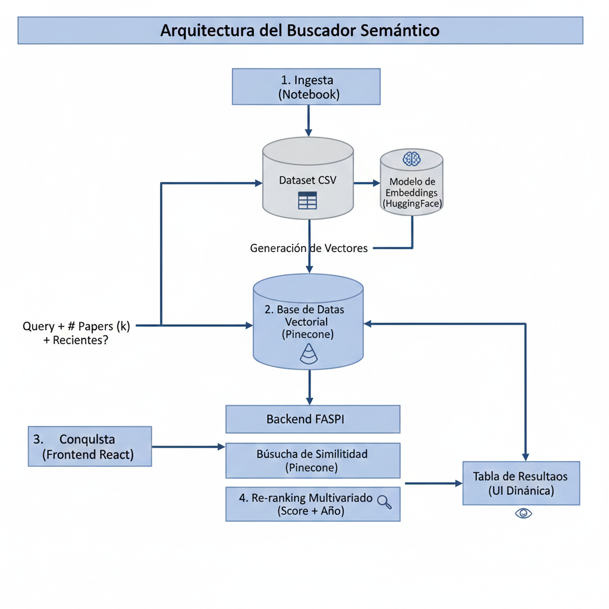

# 🔍 Semantic Academic Search Engine - Multivariate Analysis

## 📝 Summary
This project implements an advanced search engine for scientific articles, overcoming the limitations of traditional keyword searches. It uses state-of-the-art embeddings and a vector database to find papers based on their semantic meaning. The system stands out for its multivariate analysis capabilities, allowing users to weigh thematic relevance against recency (year of publication) to obtain accurate and up-to-date results.

## 🛠️ Stack of Libraries and Technologies

The project integrates modern technologies in both data processing and web development:

* **AI & NLP**: `HuggingFace` (model `all-MiniLM-L6-v2`) for generating 384-dimensional vectors.

* **Vector Database**: `Pinecone` for efficient vector similarity storage and retrieval.

* **Backend**: `FastAPI` (Python) for a high-performance API and easy integration.

* **Frontend**: `React.js` for a dynamic and responsive user interface.

* **Orchestration**: `LangChain` to connect the language models to the vector database. 

## ⚙️ System and Architecture

The system follows a data flow from document ingestion to results visualization.

The diagram represents the system's overall architecture, where the Ingest process transforms the dataset.csv into vectors using the HuggingFace model for storage in the Pinecone vector database. The operational flow begins when the user interacts with the React interface, sending a query and dynamic parameters ($k$ and time filter) to the FastAPI backend, which coordinates a semantic similarity search in Pinecone to retrieve the most relevant documents. Finally, the system applies a multivariate re-ranking that combines the similarity score with the publication year, returning a visually categorized and enriched results table to the end user.

## 💡 Conclusiones

The system demonstrates high semantic accuracy by using embeddings that identify deep contextual relationships, such as linking "Medical" with "Surgical Soft Robotics" without requiring exact keyword matches. This capability is enhanced by multivariate flexibility, where the combination of Similarity Score and publication year allows users to tailor their searches to find both solid theoretical foundations and the latest innovations. All of this is supported by a decoupled and scalable architecture that ensures optimal frontend performance even when handling thousands of documents, resulting in a robust and efficient research tool.

## 📚 Referencias

* FastAPI documentation: [https://fastapi.tiangolo.com/](https://fastapi.tiangolo.com/)
* Pinecone Vector Database: [https://www.pinecone.io/](https://www.pinecone.io/)
* HuggingFace Models: [https://huggingface.co/models](https://huggingface.co/models)
* Academic Dataset: Own / `dataset.csv`